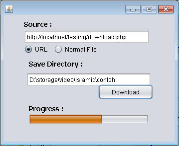

# URLFGroupLib aka. Downloader

###### :exclamation: merupakan library mempermudah proses download beserta penampakan progress bar dalam Java Swing
###### :exclamation: it is a library that helps you to download and show the progress bar within Java Swing

## English Tutorial Text :sunny:
The usage is quite simple, you have to prepare these components:
1) JProgressBar
2) Source (URL or AbsolutePath)
3) Target Directory (for saving purpose)

## Quick code:
```
Downloader tool = new Downloader();
tool.setProgressBar(jProgressBar1);
tool.setTargetAbsoluteDirectory(textfieldDirSave.getText());

tool.setSourceAbsoluteFile(textfieldSource.getText());
// or 
tool.setSourceURL(textfieldSource.getText());

tool.setOpenDirAfterComplete(true);
tool.start();
```

## Super Quick code: :sunglasses:
```
Downloader tool = new Downloader(textfieldSource.getText(), textfieldDirSave.getText(), jProgressBar1);
tool.start();
```

:zap::zap: :zap::zap: -------------------------------- :zap::zap: :zap::zap: 


## Tutorial Text Indonesia :sunny:
Penggunaannya cukup simple, yang kamu butuhin komponen ini:
1) JProgressBar
2) Source (URL atau AbsolutePath)
3) Target Directory (for saving purpose)

## Kode Cepat:
```
Downloader tool = new Downloader();
tool.setProgressBar(jProgressBar1);
tool.setTargetAbsoluteDirectory(textfieldDirSave.getText());

tool.setSourceAbsoluteFile(textfieldSource.getText());
// atau
tool.setSourceURL(textfieldSource.getText());

tool.setOpenDirAfterComplete(true);
tool.start();
```

## Kode Super Cepat: :sunglasses:
```
Downloader tool = new Downloader(textfieldSource.getText(), textfieldDirSave.getText(), jProgressBar1);
tool.start();
```


## Preview



## Credits
Goes back to (c) [FGroupIndonesia](http://fgroupindonesia.com) for educational -class / general projects' purposes.
Any questions or discussions please send via Whatsapp to the admin directly :+1: **+62857-9556-9337** for schedule arrangements.